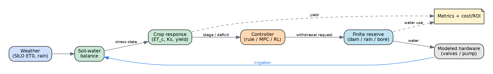

# AquaReserve - Smart Supplementary Irrigation Digital Twin

> Precision management of a finite water reserve to protect crop yield during drought.
> MSSE Capstone Project · Quantic School of Business and Technology

[[CI YAML Workflows]](https://github.com/vish8426/aquareserve/actions/workflows/ci.yml)

## Capstone Deliverables

Every component the Quantic Capstone submission requires, with its link.

| Deliverable                           | Where it is                                                                                                                                                 |
|---                                    |---                                                                                                                                                          |
| Software Repository                   | [github.com/vish8426/aquareserve](https://github.com/vish8426/aquareserve) - shared with `quantic-grader`                                                   |
| Deployed Web Application              | [aquareserve-hym8.onrender.com](https://aquareserve-hym8.onrender.com) - see **Live Application** below for the two apps and the twins                      |
| Agile Task Board                      | [github.com/vish8426/projects](https://github.com/users/vish8426/projects/4) - shared with `quantic-grader`                                                 |
| Design & Testing Document             | [Word Edition](docs/AquaReserve-Design-and-Testing-Document.docx) - Markdown source: [`docs/DESIGN_AND_TESTING.md`](docs/DESIGN_AND_TESTING.md)             |
| Recorded Demonstration (15 to 20 min) | [Google Drive](https://drive.google.com/drive/folders/1-MuKZYEpX1ILMJCBDUZmipLPyPT_Th8O)                                                                                                                                           |
| CI/CD Pipeline                        | [GitHub Actions](https://github.com/vish8426/aquareserve/actions/workflows/ci.yml) - lint, tests across Python 3.10 to 3.12, web app builds, Render deploy  |
| Product Backlog (User Stories)        | [`docs/BACKLOG.md`](docs/BACKLOG.md)                                                                                                                        |
| Comparison & Sensitivity Study        | [Word Report](docs/AquaReserve-Comparison-and-Sensitivity-Study.docx)                                                                                       |
| AI Tooling Disclosure                 | [`AI-TOOLING.md`](AI-TOOLING.md) - which AI tools were used, how and what they got wrong                                                                    |

## Live Application
Everything runs from one Render service. Free tier, so the first request after a quiet period takes about 50 seconds to wake.

| What                      | Link                                                                                      | Notes                                                                                                       |
|---                        |---                                                                                        |---                                                                                                          |
| **Results Dashboard**     | [/](https://aquareserve-hym8.onrender.com)                                                | The deliverable - yield protection, reserve sizing, economics and the twins. No login.                      |
| **Customer Product App**  | [/product/](https://aquareserve-hym8.onrender.com/product/)                               | The commercial layer - configurator, proposal PDF, save-a-quote and the live monitor demo. Login required.  |
| **Digital Twin - 2D**     | [/twins/farm_twin.html](https://aquareserve-hym8.onrender.com/twins/farm_twin.html)       | Top-down season playback driven by real engine output.                                                      |
| **Digital Twin - 3D**     | [/twins/farm_twin_3d.html](https://aquareserve-hym8.onrender.com/twins/farm_twin_3d.html) | The same season in 3D - crops grow, the reserve drains, fields are shaded by crop health.                   |
| **API**                   | [/api/docs](https://aquareserve-hym8.onrender.com/api/docs)                               | OpenAPI docs. Health check at [`/api/health`](https://aquareserve-hym8.onrender.com/api/health).            |

### Two Applications - One Deploy
The dashboard and the product app are deliberately separate builds served by the same FastAPI process.

- **`/` is the results dashboard:** This is the project deliverable - the simulation study, the controller comparison and the digital twins. It is open, so an assessor can evaluate the engineering without an account.
- **`/product/` is the customer-facing product app:** It is the commercialization path built on top of the same validated engine, so it sits behind a login the way a real product would.

### Accessing the Customer Product App
a. Click **Create an account** to self-register. 
  - Registration is open and instant and it exercises the real signup flow.

b. An administrator account also exists, which additionally shows all saved quotes across users.
  - email: adminuser@example.com.au
  - password: adminpassword

> Accounts are stored on an ephemeral filesystem, so self-registered accounts are cleared when the service restarts. Registering again takes a few seconds.

## Introduction
AquaReserve is a **closed-loop digital twin** of a software-controlled supplementary irrigation system. A mid-size mixed farm holds a *limited* backup water reserve (harvested rainwater + farm dam/bore). When drought hits, releasing that water intelligently to the right zone, at the right growth stage can mean the difference between a protected harvest and a failed one.

The core engineering problem is **constrained optimization under uncertainty**: 

Schedule a finite reserve across zones and crop growth stages, given uncertain weather forecasts, to minimise yield loss per cubic metre of water.

*Figure 1: AquaReserve Simulates the Full Loop*


It compares irrigation **control strategies** (from rainfed baseline up to Model Predictive Control with an Extended Kalman Filter state estimator), quantifies the yield protected and water saved and feeds a **cost/ROI model** that tells a farmer whether the system pays for itself.

> **Scope:** The farm-scale system is simulation only - no production hardware is deployed to a real farm. The farm hardware layer (sensors, valves, pump, edge controller, LoRaWAN/MQTT comms) is *modeled* inside the twin. A model-scale **tabletop demonstrator was built** to validate the sense decide actuation loop against a real probe, a real pump and a real finite reserve; see [`docs/DEMO_BUILD_GUIDE.md`](docs/DEMO_BUILD_GUIDE.md). See [`docs/PROJECT_PLAN.md`](docs/PROJECT_PLAN.md).

## Impact
Full rainfall replacement is physically infeasible for broadacre cereals - the storage volume required is enormous. So AquaReserve does **precision reserve management**, not full backup:

| Crop profile            | Strategy                                                                                    |
|---                      |---                                                                                          |
| Cereals (Wheat, Barley) | Deficit / critical-stage irrigation - limited water only at the most yield-sensitive stages |
| Horticulture (Onion)    | Near-full backup - high value, small area, stress-intolerant                                |

The platform stays **crop-agnostic** via configurable Kc curves and growth-stage models; only the reserve *strategy* changes per crop.

## Validation
A mixed mid-size farm in the Australian wheat-belt (Victorian Mallee, SILO/BoM climate data), configurable via `config/farm.example.yaml`:

| Crop    | Area  | System    | Strategy                |
|---      |---    |---        |---                      |
| Onion   | 4ha   | Drip      | Near-full backup        |
| Wheat   | 12ha  | Broadacre | Critical-stage deficit  |
| Barley  | 8ha   | Broadacre | Critical-stage deficit  |

Onion, wheat and barley are the calibrated crops, but the crop model is a config driven FAO-56/FAO-33 parameter pack, so the system is **crop-agnostic**: canola, pulses, other cereals, maize and horticulture are added as data packs, with perennials (winegrapes, almonds) a future extension. See [`config/crops/README.md`](config/crops/README.md).

## Architecture

```
config/           Declarative scenario config (farm, crops, climate, reserve, bom.yaml)
src/aquareserve/  
  config/         Pydantic schema + loader (validates & assembles a scenario)
  weather/        Climate loader + drought injection + empirical ensemble forecast
  models/         FAO-56 ET, soil water balance, crop yield, reserve dynamics (transparent engine, validated vs pyfao56 & AquaCrop-OSPy)
  estimation/     Root-zone water estimators - EKF, then EnKF
  controllers/    Rainfed, fixed, threshold, smart-rule, MPC, robust MPC, oracle, RL
  simulation/     Closed-loop digital-twin engine / orchestrator
  metrics/        Yield, water-use efficiency, stress-days, gross margin, payback
  configurator/   Farm profile -> sized system + quote + payback (product MVP)
backend/          FastAPI service - serves precomputed results + configurator + auth (DuckDB)
frontend/         React + TypeScript + ECharts results dashboard (served at /)
product/          React + TypeScript customer app: configurator + live Monitor demo (served at /product)
docs/             Project plan, backlog, design & testing document
```

## Tech Stack
- **Simulation & Modeling:** Python · NumPy · SciPy · pandas
- **Crop Model:** Own transparent FAO-56 (Penman-Monteith ET₀, Kc/Ks) + FAO-33 yield (Ky), **validated against `pyfao56` and AquaCrop-OSPy**
- **Control:** 
  - Rule-based
  - Model Predictive Control (receding-horizon LP via `scipy.optimize.linprog`/HiGHS) 
  - Robust quantile MPC 
  - Perfect-foresight oracle 
  - RL (Cross-Entropy Method in NumPy; optional `Gymnasium` + `Stable-Baselines3` PPO)
- **State Estimation:** Extended Kalman Filter, then Ensemble Kalman Filter
- **Forecasting:** Empirical ensemble resampling (NumPy) → robust quantile MPC
- **Backend:** FastAPI - precompute and serve results in Parquet + DuckDB
- **Frontend:** Vite - React - TypeScript - Apache ECharts
- **Deploy:** Single Render free-tier service (API serves the built dashboard)
- **Quality:** pytest - ruff - mypy - GitHub Actions CI

## Quickstart

```bash
# 1. Create a virtual environment
python -m venv .venv && source .venv/bin/activate   # Windows: .venv\Scripts\activate

# 2. Install (editable, with dev extras)
pip install -e ".[dev]"

# 3. Validate the example scenario configs
python -m aquareserve.cli validate

# 4. Run the test suite
pytest -q
```

## Web Dashboard & Deployment
The dashboard follows a **precompute and serve** design: 

The engine precomputes the scenario x controller x reserve-size results once, then a thin FastAPI service serves that store to a React + ECharts frontend. Nothing runs the simulation at request time.

Run it locally (two terminals):

```bash
# terminal 1 - backend (from the repo root, venv active)
pip install -e ".[api]"
python scripts/run_matrix.py            # precompute data/results/ (the E2 store)
python scripts/export_twin.py --json    # build the twin viewers + twin_data.json
uvicorn backend.app.main:app --reload   # http://127.0.0.1:8000  (API + docs at /docs)

# terminal 2 - frontend dev server
cd frontend && npm install && npm run dev   # http://localhost:5173 (proxies /api, /twins)
```

Production build (one server): 

`cd frontend && npm run build`, then run uvicorn from the repo root - the API serves the built `frontend/dist` at `/` and the twin viewers at `/twins`.

There are **two web apps**: 
1. the green **results dashboard** (`frontend/`, the project deliverable, served at `/`) and 
2. the customer **product app** (`product/` served at `/product`). 

The product app is login-gated (customer accounts plus an admin) and holds a self-serve configurator (farm profile to sized system, quote and payback), a downloadable proposal PDF, a save-a-quote form and a **live Monitor demo** that runs the "sense decide actuate" loop against the backend with no hardware. They share the API. Build the product app the same way (`cd product && npm run build`); in dev it runs on Vite port 5174.

**Deploy:** A single Docker web service on Render (`Dockerfile` + `render.yaml`). The image builds the frontend, installs the Python core plus the API extra, precomputes the store and twin data, then serves everything on `$PORT`. Render health-checks `/api/health` and auto-deploys on push to `main`; CI (GitHub Actions) lints, tests the engine and API, builds the dashboard and (with a `RENDER_DEPLOY_HOOK` secret) triggers the deploy. Three.js is vendored under `viz/`, so the 3D twin has no CDN dependency.

## Project Status
This repository was built **phase by phase** across four project sprints. The engine, controller ladder, estimators, validation, cost/ROI model, the precompute and serve backend, the React results dashboard (with the 2D/3D twins) and the Docker/Render deploy are all in place, plus a login-gated customer product app (configurator, proposal PDF, save-a-quote and a live Monitor demo) and the comparison and sensitivity study (see [`docs/AquaReserve-Comparison-and-Sensitivity-Study.docx`](docs/AquaReserve-Comparison-and-Sensitivity-Study.docx) and section 6.10 of the design doc). 

The full design and testing write up is [`docs/DESIGN_AND_TESTING.md`](docs/DESIGN_AND_TESTING.md) (and its consolidated Word version). The suite stands at **157 automated tests** across a Python 3.10-3.12 CI matrix; the demo recording is the remaining item. See [`docs/PROJECT_PLAN.md`](docs/PROJECT_PLAN.md) for the full roadmap and [`docs/BACKLOG.md`](docs/BACKLOG.md) for user stories.

## Repository Conventions
- Source lives under `src/` (src-layout); tests under `tests/`.
- All scenario inputs are declarative YAML under `config/` and validated by the Pydantic schema in `src/aquareserve/config/schema.py` - **no magic numbers in code**.
- Design and architecture decisions are recorded in [`docs/DESIGN_AND_TESTING.md`](docs/DESIGN_AND_TESTING.md).

## License
**Proprietary - All Rights Reserved:** This project is not open source. No use, copying, modification or distribution is permitted without the author's prior written permission; see [`LICENSE`](LICENSE). Repository access is provided to Quantic solely for MSSE Capstone/Thesis evaluation.

## Acknowledgements
Climate Data: SILO (Queensland Government / Longpaddock) and the Australian Bureau of Meteorology. Crop coefficients follow FAO Irrigation & Drainage Papers 56 and 33.
