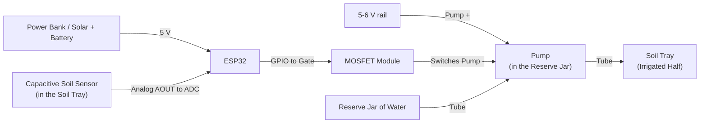

# AquaReserve - Tabletop Demonstrator Build Guide
A small, model-scale rig that shows the AquaReserve loop working in real life: 
A soil tray with seeds, a finite water tank standing in for the reserve, a water pump, a soil-moisture sensor and a microcontroller that decides when to water. 

It can run on its own logic or be driven by the same kind of controller logic as the simulated system, so the hardware and the software tell one story.

Everything here is buyable today from COTs suppliers. Prices are indicative AUD and vary; confirm in store.

> Safety: This is a **low-voltage (5-6 V) DC** build. Keep all electronics away from mains power, never put the microcontroller or battery in water, keep the pump's wiring above the waterline and dry your hands. Water and mains electricity must never meet.

## 1. What it Demonstrates
The real system senses soil moisture, decides how to spend a finite reserve across zones to protect yield and acts by opening a valve or running a pump. The model mirrors that exactly:

| Real System                             | Model-Scale Stand-In                                          |
|---                                      |---                                                            |
| 20ML Water Reserve (Finite)             | A small jar or bottle of water (the "tank")                   |
| Solar Panel + Battery + Edge Controller | Mini 6V solar panel and/or a USB power bank + an ESP32 board  |
| Soil-Moisture Probe per Zone            | Capacitive soil-moisture sensor in the tray                   |
| Solenoid Valve + Pump                   | A 3-6V submersible pump (and optional mini valve)             |
| Drip Line to a Field                    | Thin vinyl tubing to the soil tray                            |
| Crop Yield Protected vs Rainfed         | Two tray halves: one irrigated, one left dry (the control)    |
| The Controller (Threshold, MPC)         | Logic on the ESP32 or the AquaReserve controller over WiFi    |

The irrigated half germinates and grows while the dry control half struggles, and when the "reserve" jar runs dry the system stops watering - showing that the whole point is spending a limited reserve wisely.

## 2. Two Build Tiers
- **Tier 1 - Standalone Model**: 
  - The ESP32 runs a simple soil-moisture threshold locally and tracks a virtual reserve. 
  - No software or network needed. Build this first.
- **Tier 2 - Software-in-the-Loop**: 
  - The ESP32 sends its soil and tank readings over WiFi to a small AquaReserve companion service, which runs a controller (the same family as the
  simulated system) and sends back a watering command. 
  - This is the one that connects the model to the project.

## 3. Shopping List
### Electronics
- ESP32 dev board (ESP32-WROOM DevKitC or similar) - approx $15-25.
- Capacitive soil-moisture sensor v1.2/v2.0 (corrosion-resistant; a 3-5 pack is cheaper) - approx $10-15.
- Mini submersible water pump, 3-6V DC - approx $8-12.
- Logic-level MOSFET to switch the pump - approx $5-10. 
  - Two options:
    - Easiest: A **MOSFET driver module** (IRF520 board) - the gate resistor, pull-down and terminals are already on the board, so you just wire signal, pump and power.
    - Cheaper but needs extras: **bare IRLZ44N transistors**. With a bare MOSFET also get a small resistor assortment (a **220 ohm** gate resistor and a **10k ohm** gate pull-down) and a **flyback diode** (1N4007 or a 1N5819 Schottky) across the pump to protect the MOSFET.
- Jumper wires + a mini breadboard - approx $10.
- Optional mini 6V 1-2W solar panel (to represent the solar) - approx $10-15.
- Optional DC-DC buck converter (solar/battery down to 5V) - approx $5.
- Optional second pump or a small 6V solenoid valve for a two-zone version - approx $10-15.

### The "Farm"
- Seed-raising tray or a shallow planter tray - approx $3-8.
- Small bag of seed-raising or potting mix - approx $5-10.
- Fast-germinating seeds (wheat/wheatgrass, radish, cress or a microgreens mix) - approx $3-5.
- Vinyl or poly tubing, 6-8mm, a metre or two - approx $2-4/m.
- A small clear jar or bottle for the reserve tank (or reuse one) - approx $0-5.
- A timber offcut or dowel to mount the sensor and tubing - approx $3-8.
- Cable ties and a little silicone sealant - approx $5-8.

### Power, Cables & Presentation

- USB power bank (powers the ESP32; a clean 5V source) - approx $20-30.
- USB cable for the ESP32 (micro-USB or USB-C to match the board) - approx $5-10.
- Foam board or a display board plus printed labels for the backdrop - approx $5-10.
- A storage tray or base to hold it all and catch spills - approx $5-10.

**Indicative Total:** roughly $90-130 for Tier 1, a little more with the solar panel, second zone and presentation extras.

## 4. How it Goes Together
The same wiring as a flowchart (renders on GitHub and in Obsidian):



Sense (sensor to the ESP32), decide (the ESP32 or the bridge), actuate (the ESP32 drives the MOSFET, which switches the pump). 
The pump is always powered from the 5-6V rail, never straight from a GPIO pin.

- The capacitive sensor sits in the soil; its analog output goes to an ESP32 ADC pin. On a classic ESP32-WROOM use GPIO 34; on an **ESP32-S3** use an ADC1 pin (GPIO 1 to GPIO 10) and set `SOIL_PIN` in the firmware to match (the default 34 is a WROOM pin).
- The ESP32 switches the pump through the MOSFET module (pump power comes from the same 5-6V rail, not from a GPIO pin directly - a pump draws too much current for a pin).
- The pump sits in the reserve jar and pushes water through the tube to the irrigated half of the tray. Leave the other half dry as the rainfed control. 
- Optional: A mini solar panel through a buck converter (or into a small battery) powers the rig, standing in for the off-grid solar node.

## 5. Firmware
### Tier 1 - Standalone Threshold (Arduino-Style Pseudo-Code)
```cpp
const int SOIL_PIN = 34, PUMP_PIN = 26;
float reserve_ml = 500.0;                       // the finite "reserve" (a virtual budget)
const float PUMP_ML_PER_SEC = 8;                // measured for your pump

void loop() {
  int raw = analogRead(SOIL_PIN);               // 0..4095
  float moisture = map(raw, DRY, WET, 0, 100);  // calibrate DRY/WET once
  
  if (moisture < 35 && reserve_ml > 0) {        // dry and reserve not empty
    digitalWrite(PUMP_PIN, HIGH);
    delay(2000);                                // a 2 s pulse
    digitalWrite(PUMP_PIN, LOW);
    reserve_ml -= PUMP_ML_PER_SEC * 2;          // spend the reserve
  }

  // when reserve_ml <= 0, watering stops -> the crop starts to stress (the whole point)
  delay(60000);                                 // check each minute (speed up for a live demo)
}
```

### Tier 2 - Software-in-the-Loop
The ESP32 reports its state and asks the AquaReserve companion service what to do:
```cpp
// POST {"zone":"tray-1","moisture_pct":31.4,"reserve_ml":420} -> {"pump_ms": 2000, "reason": "below threshold at a critical stage"} 
// Then run the pump for pump_ms and subtract the spent volume.
```

A tiny Python companion (separate from the production API, reusing the same controller idea) makes the decision:
```python
# scripts/demo_bridge.py (sketch) - run:
# uvicorn scripts.demo_bridge:app --host 0.0.0.0
from fastapi import FastAPI
from pydantic import BaseModel

app = FastAPI()

class State(BaseModel):
    zone: str
    moisture_pct: float
    reserve_ml: float

@app.post("/demo/decide")
def decide(s: State):
    # same logic family as the real controllers: water only when dry and the reserve survives.
    # a real build can import aquareserve controllers and drive this from the live twin.
    if s.moisture_pct < 35 and s.reserve_ml > 0:
        return {"pump_ms": 2000, "reason": "below threshold, reserve available"}
    return {"pump_ms": 0, "reason": "moist enough or reserve exhausted"}
```

For the full effect, the bridge can import an `aquareserve` controller (for example the threshold or the linear RL policy) so the model is driven by the project's control logic and it can post each reading to the dashboard so the on-screen twin and the physical tray move together.

### Ready-Made Code
The sketches above ship as runnable files, so you can test the whole loop with no hardware:
- `scripts/demo_bridge.py` - The companion service (run `python scripts/demo_bridge.py`).
- `scripts/demo_sim_client.py` - A software ESP32 emulator that dries out a virtual soil and drives the loop against the bridge (`python scripts/demo_sim_client.py`).
- `demo/esp32/aquareserve_demo.ino` - The complete ESP32 firmware for the real rig.
- `demo/README.md` - How to run the software-only demo and how to flash the hardware.

## 6. Assembly Steps
1. Fill the tray with mix, dampen it and sow the fast-germinating seeds across both halves.
2. Push the capacitive sensor into the irrigated half; wire it to the ESP32 ADC pin and 3V3/GND.
3. Wire the pump through the MOSFET module; pump power from the 5-6V rail, gate from a GPIO pin.
4. Put the pump in the reserve jar; run tubing from the pump to the irrigated half of the tray.
5. Power the ESP32 from the power bank (or the solar panel through the buck converter).
6. Calibrate the sensor - note the raw reading in dry mix and in wet mix, set DRY and WET.
7. Measure the pump - run it into a measuring cup for 10 seconds to get millilitres per second.
8. Flash Tier 1 firmware, watch it water when dry and stop when the jar is empty.
9. For Tier 2, start the companion service and point the ESP32 at its address.

## 7. Running the Demonstration
- Start with both halves just-sown and the reserve jar full. 
- Over a few days the irrigated half germinates and greens up while the dry control lags.
- Let the reserve jar run low on purpose: the system stops watering.
- In Tier 2, the same reading flowing into the dashboard so the physical tray and the digital twin agree.

## 8. Future Extras
- A float or ultrasonic level sensor in the jar so the "reserve" is measured, not just assumed.
- A small OLED or a few LEDs showing moisture, reserve level and pump state for a tidy display.
- A clear jar so the falling water level is visible as the reserve drains.

---

The runnable code is in this repo (
  `scripts/demo_bridge.py`, 
  `scripts/demo_sim_client.py`,
  `demo/esp32/aquareserve_demo.ino`); 
  see `demo/README.md`. 
  
  The bridge already mirrors the `aquareserve` controller logic and can import a real controller for a full engine-in-the-loop build.
