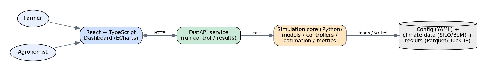
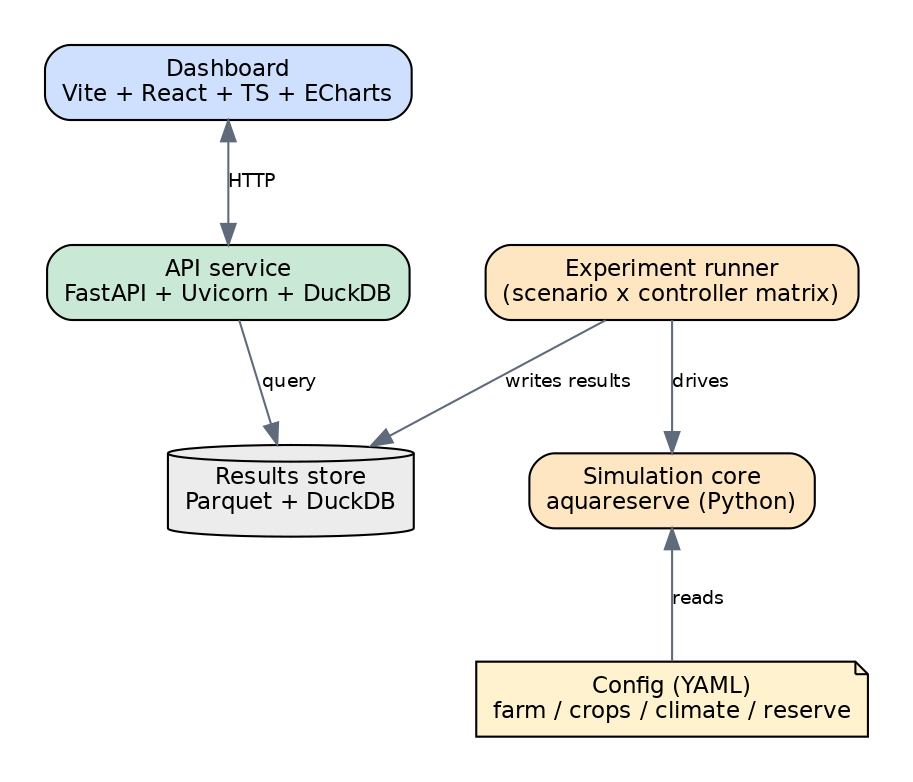

# AquaReserve - Design & Testing Document
> This is the Quantic Masters of Science of Software Engineering Capstone required Design and Testing document.  
This document records (1) the Design and Architecture Decisions documentation - Technologies, Architectural Choices, Software/Architectural Patterns and the Reasoning for them, plus Recommended Deployment Options and their Cost Implications - and (2) the Software Testing carried out, including Automated Tests and why. 

It is a **living document**; sections are expanded as each phase lands. Sections marked *(planned)* are placeholders for upcoming sprints but at submission of this document should be viewed as Future Scope / Future Work to build off from this Capstone Project.

**Last Updated:** Phase 8 (Sprint 4) - All Phases Delivered; Consolidated for Final Submission.
A polished Word edition of this document is at [`AquaReserve-Design-and-Testing-Document.docx`] (AquaReserve-Design-and-Testing-Document.docx).

## 1. System Overview
AquaReserve is a closed-loop **digital twin** of a supplementary irrigation system.

It simulates the loop *weather → soil-water balance → crop response → reserve dynamics → (modeled) hardware → controller → back to soil*, time-stepped daily with sub-day resolution for irrigation events. 

Around the simulation are **metrics & cost/ROI** layer, a **FastAPI** service and a **React + TypeScript** dashboard
(Apache ECharts) for monitoring and simulation playback.

The engine is a **transparent, control-oriented** implementation (FAO-56/FAO-33) so the estimator (EKF/EnKF) and controllers (MPC oracle, RL) have clean state equations to work with; its correctness is **independently validated** against the published `pyfao56` and AquaCrop-OSPy models. Experiment results are **precomputed** into a Parquet/DuckDB store and *served* by the API, so the graded demo never depends on running heavy simulations live on free-tier hosting.

### 1.1 Architecture Context

### 1.2 Container View

| Container         | Tech                                        | Responsibility                                                                                                |
|---                |---                                          |---                                                                                                            |
| Simulation Core   | Python Package `aquareserve`                | Engine, Models, Estimator (EKF/EnKF), Controllers (baseline/rule/MPC/oracle/RL), Metrics                      |
| Experiment Runner | Python + Parquet                            | Precompute the Scenario × Controller Matrix into a Results Store                                              |
| API Service       | FastAPI + Uvicorn + DuckDB                  | Serve Precomputed Results/Time-Series; Drive the Configurator, Proposal PDF, Auth and the Live Demo           |
| Results Dashboard | Vite + React + TypeScript + Apache ECharts  | Monitoring + Season Playback + KPI/Comparison Views (Served at `/`)                                           |
| Product App       | Vite + React + TypeScript                   | Login-Gated Customer App: Configurator, Proposal, Save-a-Quote and a Live Monitor Demo (Served at `/product`) |
| Results Store     | Parquet Files + DuckDB                      | Analytical Queries over run Results/Time-Series                                                               |
| Config            | YAML under `config/`                        | Declarative Farm/crop/climate/Reserve Definitions plus `bom.yaml` Cost Source                                 |

## 2. Design Principles
1. **Config-Driven, not Code-Driven:** Every agronomic constant lives in validated YAML; the engine contains logic, not magic numbers. This makes the platform crop-agnostic and experiments reproducible.
2. **Local-First:** Safety-critical control logic must run offline and is never gated by a subscription; cloud features (forecasts, multi-season optimisation, analytics, OTA) are additive. 
3. **Strategy-Pluggable Control:** Controllers share one interface so baselines, rule-based, MPC and RL are swapped without touching the simulation loop.
4. **Fail Loud on Bad Input:** Schema validation rejects physically impossible configurations at load time rather than producing silently wrong results.

**Crop Coverage:**  
Because the crop model is a config-driven FAO-56/FAO-33 parameter pack, the system is not limited to the three calibrated crops (onion, wheat, barley). Adding a crop is a data change (one YAML pack), not a code change. The best-fit crops are the high-value and drought-sensitive ones where a small, well-timed volume protects a disproportionate share of yield: 
- oilseeds (canola)
- pulses (chickpea, lentil, field pea, faba bean)
- other cereals (oats, triticale, maize) and 
- horticulture (potato, tomato, carrot and similar)

Perennial vines and trees (winegrapes, almonds, citrus) are a strong future target once the engine models a perennial
cycle. 

Rice and sugarcane are outside the finite-supplementary paradigm. The full candidate list and the pack format are in [`config/crops/README.md`](../config/crops/README.md).

## 3. Architecture & Design Decisions (ADRs)
Format: *Decision - Context - Reasoning - Consequences*.

### ADR-001 - Python for the Simulation Core
- **Decision:** Implement the simulation/modeling/control in Python.  
- **Context:** Scientific simulation with crop, soil and control models; rich ecosystem needed (NumPy/SciPy/pandas, do-mpc, Gymnasium/SB3, aquacrop). 
- **Reasoning:** Unmatched scientific/ML library support; fastest path from FAO equations to working code; aligns with the owner's sensor-fusion/controls background. 
- **Consequences:** Raw numeric loops are slower than C++ - mitigated with vectorised NumPy and (if needed) the option to drop the edge-control loop to C/C++ later.

### ADR-002 - Source Layout Package + Declarative YAML Config
- **Decision:** `src/aquareserve/` package; scenarios defined in `config/*.yaml`, validated by Pydantic. 
- **Reasoning:** Source layout prevents accidental imports of un-installed code and is the modern packaging standard. Pydantic gives schema validation, type coercion and clear errors for free. Separating config from code keeps the platform crop-agnostic and makes experiment sweeps trivial (swap a file, not the code). 
- **Consequences:** A small amount of schema boilerplate; repaid immediately by catching invalid scenarios at load time (see tests in §6). 

### ADR-003 - Strategy Pattern for Controllers
- **Decision:** All controllers implement a common `observe(state) → per-zone request` interface. 
- **Reasoning:** The comparison study (rainfed → fixed → threshold → smart → MPC → RL) is the project's core experiment; a uniform interface makes controllers interchangeable and the metrics harness controller-agnostic. 
- **Consequences:** Advanced controllers must adapt to the shared interface; worthwhile for clean comparison.

### ADR-004 - Climate Data via Abstracted Loader (SILO/BoM) with Synthetic Fallback
- **Decision:** Loader abstracts the climate source; ships a deterministic synthetic generator for tests/CI.
- **Reasoning:** SILO provides daily FAO-56 ET₀ for Australia, ideal for the Mallee validation case, but network access is undesirable in CI. The abstraction lets tests run offline and lets the region be swapped later.
- **Consequences:** Two code paths (real vs synthetic) to keep behaviourally aligned.

### ADR-005 - Transparent FAO-56/FAO-33 Engine, Validated against Published Models
- **Decision:** Implement our *own* control-oriented crop-water engine (FAO-56 Penman-Monteith ET with Kc/Ks(stage); FAO-33 Ky yield response) and independently. 
  - **Validate** it against the peer-reviewed `pyfao56` package and the mechanistic AquaCrop-OSPy model on shared scenarios.
- **Context:** The estimator (EKF/EnKF) and controllers (MPC oracle) need explicit, differentiable state equations for the soil-water dynamics. A third-party model used as a black box cannot expose those equations cleanly.
- **Reasoning:** Owning the engine gives clean state/observation equations for control and estimation, full transparency and reproducibility. 
  - Cross-validating against two independent, published models (a like-for-like FAO-56 implementation and a more mechanistic model) provides a credible verification story without sacrificing control integration - the best of both.
- **Consequences:** We maintain the engine and a validation harness; repaid by control integration and a strong, defensible correctness argument (see §6).
  - **Alternatives Rejected:** *Build on pyfao56 directly* (loses control over internal state equations); *AquaCrop-OSPy as the plant* (more realism but heavy integration friction and an opaque model for control).

### ADR-006 - EKF then EnKF for Root-Zone State Estimation
- **Decision:** Fuse noisy/sparse soil-moisture sensors with the soil-water-balance model using an Extended Kalman Filter (EKF), then add an Ensemble Kalman Filter (EnKF) and compare estimation error.
- **Context:** The soil-water balance is mildly nonlinear (ET/stress terms); root-zone soil-moisture data assimilation is a well-studied problem.
- **Reasoning:** EKF is lightweight, transparent and reuses the owner's sensor-fusion portfolio. EnKF is the **domain state-of-the-art** for assimilating soil-moisture into crop/soil models (literature reports 30-60% root-zone error reductions) and handles nonlinearity via a stochastic ensemble. 
  - Implementing both turns "control under uncertainty" into a concrete, measurable comparison.
- **Consequences:** Two estimators to maintain and tune (process/measurement covariances; ensemble size), isolated in `estimation/`; EnKF is more compute per step.

### ADR-007 - Perfect-Foresight Oracle & RL Comparison Policy
- **Decision:** Benchmark controllers against 
  - (a) a **perfect-foresight optimisation "oracle"** (CasADi) that sees the true future weather and 
  - (b) a **reinforcement-learning** policy (Gymnasium + Stable-Baselines3).
- **Context:** The core claim is "smart control preserves yield under uncertainty" - which needs both a lower bound (baselines) and an upper bound (oracle) to be meaningful.
- **Reasoning:** The oracle quantifies the *cost of forecast uncertainty* (gap between realistic control and the unattainable optimum) - a rigorous, cheap thesis result. 
  - RL provides an AI-engineering technique and an alternative-policy comparison, aligning with the system's AI emphasis and current (2024-25) irrigation-control literature. 
  - CasADi is already a do-mpc dependency, so the oracle reuses existing tooling.
- **Consequences:** RL adds training/tuning effort - scheduled after the MVP and scoped as a comparison, not a dependency of the core system.

### ADR-008 - Precompute & Serve Results Architecture (Parquet + DuckDB)
- **Decision:** Run the experiment matrix **offline** into a Parquet/DuckDB results store; the FastAPI service serves those results (and may trigger small bounded runs), rather than executing full simulations per request.
- **Context:** Free-tier hosting sleeps and has limited CPU/RAM; the graded demo must be reliable and fast.
- **Reasoning:** decouples heavy computation from request-time, guaranteeing a responsive, always-working demo; Parquet + DuckDB give fast analytical queries over run results with zero database ops. Reproducible results are versioned artefacts.
- **Consequences:** Results are refreshed by re-running the experiment runner; a small live-run endpoint is kept for interactivity, bounded to stay within free-tier limits.
  - **Alternatives Rejected:** The *live-sim backend* (timeout/latency risk during grading); *static-only site* (no interactivity, no live runs).

### ADR-009 - Vite + React + TypeScript + Apache ECharts for the Dashboard
- **Decision:** Build the dashboard with Vite + React + TypeScript and Apache ECharts. 
- **Reasoning:** TypeScript adds type safety expected of quality front-end code; Vite is the modern fast toolchain; **ECharts** outperforms lighter React chart libraries on large, multi-series scientific time-series and season *playback* (canvas/WebGL, brushing, drill-down) - the dashboard's core interaction.
- **Consequences:** ECharts' imperative option model is slightly less "React-native" than component-first libraries; wrapped behind small typed React components.

### ADR-010 - MPC Solved as Linear Program with Scipy (not Do-MPC)
- **Decision:** Implement the Model Predictive Controller as a receding-horizon *linear program* solved each day with `scipy.optimize.linprog` (HiGHS), rather than the do-mpc/CasADi nonlinear framework.
- **Context:** The controller must run reliably in CI and in the graded demo and the soil-water balance has non-smooth kinks (the Ks stress threshold, drainage clamp) that are awkward for a gradient-based nonlinear solver.
- **Reasoning:** A linear planning model (irrigation offsets crop ET, stress measured as depletion past RAW, reserve budget as a single constraint) captures the essential allocation trade-off, is convex and always solvable and re-solving daily (receding horizon) self-corrects the linearisation and forecast error. 
  - Scipy is a core dependency, so there is no install or convergence risk. 
  - The forecast is intentionally imperfect (recent-mean, zero rain); the gap to the perfect-foresight oracle then measures the value of better forecasting. 
- **Consequences:** The plant model inside the optimiser is an approximation of the full nonlinear engine; acceptable because the controller acts on the true engine each day and the approximation only guides planning. do-mpc/CasADi remains available for a nonlinear MPC extension.

### ADR-011 - Stochastic MPC as Robust Quantile Forecast, not Scenario-Recourse LP
- **Decision:** Implement the "stochastic MPC" as the linear program driven by an upper *quantile* of an ensemble demand forecast, rather than a multi-scenario two-stage recourse LP.
- **Context:** The realistic MPC plans against one point forecast, ignoring uncertainty. 
  - The natural stochastic-programming form - one shared first-stage decision plus per-scenario recourse minimising expected stress - was built and tested first. 
  - With independent per-scenario reserve budgets and free recourse, the shared first-stage decision became degenerate and true-yield performance collapsed (severe-year production fell from about 173t to ~134t on the then-synthetic severe year), because recourse could "solve" each scenario alone, leaving today's committed decision underdetermined.
- **Reasoning:** A robust/quantile posture captures the same intent - hedge against futures worse than the mean - while reusing the proven, convex LP unchanged (only the `_forecast` hook differs, exactly as the oracle reuses it). 
  - Each day it draws an ensemble from an empirical resampling forecaster and plans against the q-quantile (default q = 0.7), with rain held at zero (drought-robust). 
  - This is fast (~1s/run, no LP size blow-up), always solvable and monotone in the risk knob q.
- **Consequences:** 
  - The controller does not model rain opportunistically and exposes a single interpretable risk parameter. 
  - Under the real 2019 drought it ties the point-forecast MPC (211.9t vs 213.0t); under a harsher, hotter drought the hedge matters more, so against an earlier synthetic severe year it matched the perfect-foresight oracle without foresight.
  - In a tight season a higher q can even exceed the oracle - a real artefact of the oracle being optimal only for the *linear* stress proxy while true yield is stage-multiplicative, so hedging harder toward critical high-value stages beats the proxy-optimal plan. 
  - The scenario-recourse LP remains available for future work with a shared cumulative budget and a risk measure (e.g. CVaR).

### ADR-012 - RL Comparison Policy via Cross-Entropy Method in NumPy, Deep RL
- **Decision:** Implement the reinforcement-learning comparison policy as a compact linear policy trained by the **Cross-Entropy Method** (derivative-free policy search) in pure NumPy, evaluating candidates directly on the simulation engine. 
  - A Gymnasium environment (`rl/env.py`) plus a Stable-Baselines3 PPO script (`scripts/train_rl_sb3.py`) provide the deep-RL path, but are not part of CI or the default demo. 
- **Context:** The project wants an AI/learned policy to compare against the model-based controllers, but PyTorch/SB3 is a large dependency, deep-RL training is slow and stochastic, and the graded comparison must be reproducible and CI-safe. 
- **Reasoning:** CEM is a legitimate, well-known RL/policy-search method that needs only NumPy, trains in tens of seconds and is fully seeded/reproducible. 
  - Crucially, CEM scores each candidate by *running the real engine* and returning farmgate production value, so the training objective is exactly the deployment objective and the RL policy is judged on the same engine as every other controller (no train/eval mismatch, unlike a separate Gym-env model). 
  - Returns are normalised per weather to each scenario's rainfed->oracle range so a normal and a drought year weigh equally rather than the wetter year dominating. 
  - Trained weights are committed (`rl/_pretrained.py`) so the demo needs no retraining.
**Consequences:** The RL policy learns a sensible strategy from scratch that is competitive with the rule baselines in a normal year (257t) but under the real 2019 drought trails them (184t vs the threshold's 196t) and the model-based MPC (213t).
  - The expected model-free vs model-based gap, sharpened by a real drought regime the compact linear policy must generalise to.
  - The optional PPO path can be run locally for a deep-RL data point without burdening CI.

> **Software/Architectural Patterns Used & Why:** 
> - Strategy (Controllers), 
> - Repository/Loader (Config & Data Access), 
> - Schema-Validation/Value-Object (Pydantic Models as Validated Value Objects), 
> - Pipeline (the Daily Simulation),
> - Dependency Injection by Config (Scenario Object Wires the Engine). 
> 
> Reasons are given in the ADRs above.

## 4. Technology Choices Summary

| Layer             | Choice                                                              | Primary Reason                                |
|---                |---                                                                  |---                                            |
| Sim Language      | Python 3.11+                                                        | Scientific Ecosystem                          |
| Config/Validation | Pydantic v2                                                         | Schema + Clear Errors                         |
| Numerics          | NumPy / SciPy / pandas                                              | Vectorised Models, Time-Series                |
| Crop-Water Engine | own FAO-56/FAO-33 (control-oriented)                                | clean State Equations for Control             |
| Engine Validation | pyfao56 + AquaCrop-OSPy                                             | Independent, Published Cross-Checks           |
| Estimation        | custom EKF + EnKF (NumPy/SciPy)                                     | transparency, reuse, SOTA comparison          |
| Control           | scipy linprog/HiGHS (MPC, robust MPC, Oracle); Gymnasium + SB3 (RL) | convex + CI-safe + upper bound + AI policy    |
| Forecasting       | Empirical Ensemble Resampling (NumPy)                               | probabilistic forecast -> robust quantile MPC |
| API               | FastAPI + Uvicorn                                                   | async, typed, auto-docs                       |
| Results Store     | Parquet + DuckDB                                                    | fast analytical queries, zero-ops             |
| UI                | Vite + React + TypeScript + Apache ECharts                          | typed, scientific time-series playback        |
| CI                | GitHub Actions                                                      | free, integrates with repo                    |

## 5. Deployment Options & Cost Implications
AquaReserve has two deployment faces - the **Product** (dashboard + API) and the *Modeled Edge System** (documented, not built).

### 5.1 Product (Dashboard + API)
| Option                                                  | Description                                                                                               | Indicative Cost           | When                              |
|---                                                      |---                                                                                                        |---                        |---                                |
| **Single Free-Tier Service**                            | One Render Service: FastAPI Serves the Built React App + API; Precomputed Parquet/DuckDB Results on Disk  | **$0** (Sleeps when Idle) | Demo & Grading                    |  
| Split Static + API                                      | React Static Site on Vercel/Netlify + API on Render                                                       | **$0**                    | if Faster Static Hosting wanted   |
| Small Cloud VM                                          | 1-vCPU VM Running API + Postgres                                                                          | ~Low Monthly              | Small Pilots                      |
| Managed Cloud                                           | Container Service + Managed Postgres/TimescaleDB + Object Storage                                         | Higher Monthly            | Multi-Farm SaaS                   |
| On-Premises                                             | Farm-Office Server / NUC                                                                                  | One-off Hardware          | Air-Gapped/Local-First Preference |

**Recommendation:**   
- Deploy as a **single free-tier Render service** - one public URL, zero cost and a bulletproof demo because results are precomputed (see ADR-008) rather than simulated live.  
- For a real product, the **local-first** design means the offline core runs on-prem/edge while *premium cloud features* (forecasts, multi-season optimisation, analytics, OTA) run on managed cloud - the subscription funds the recurring cloud cost while never gating safety-critical local control.

### 5.2 Modeled Edge System (Documented)
Edge controller (ESP32-class) running a C/C++ local loop; LoRaWAN field sensors → MQTT gateway; solar + battery for off-grid resilience. Capex is dominated by **water storage**, then the gateway, then per-zone nodes. Quantified in the Phase 6 cost/ROI model.

## 6. Testing Strategy
### 6.1 Philosophy & Test Pyramid
A broad base of fast **unit tests** (pure functions: unit conversions, ET, soil-water balance, yield, reserve), a middle layer of **integration tests** (config loading and scenario assembly; a full simulation step; controller-in-the-loop) and a thin top of **end-to-end** checks (API → run → results; a smoke run of the experiment matrix).  
All run in CI on every push/PR across Python 3.10-3.12.

| Layer                     | Examples                                                                                                                                    | Tooling |
|---                        |---                                                                                                                                          |---                                    |
| Unit                      | Unit conversions, FAO-56 ET vs worked example, soil-water bounds, Ky yield, reserve non-negativity                                          | pytest                                |
| Integration               | Example scenario loads & validates; invalid configs rejected; one engine step                                                               | pytest + fixtures                     |
| **Reference Validation**  | Our engine vs **pyfao56** (ET, soil-water balance) and **AquaCrop-OSPy** (biomass/yield) on shared scenarios, within documented tolerances  | pytest + reference outputs            |
| Property/Sanity           | Soil water stays within [WP, FC]; reserve never negative; more water ⇒ ≥ yield (monotonicity)                                               | pytest (parametrised)                 |
| Regression                | Golden-run metrics for a fixed scenario don't drift unexpectedly                                                                            | pytest + stored fixtures              |
| E2E *(Planned)*           | API launches a run and returns results; dashboard smoke                                                                                     | pytest + httpx; Playwright (optional) |

### 6.2 Why these Methods
- **Validation Tests:** Rejecting impossible soils/reserves/crops - catch the most damaging class of bug - silently-wrong physical inputs - at the boundary.
- **Reference-Checked Numeric Tests:** (FAO worked examples) keep the agronomy honest.
- **Cross-Model Reference Validation:** Against `pyfao56` and AquaCrop-OSPy is the strongest correctness evidence: if our transparent engine tracks two independent, published models within tolerance, the results are trustworthy - and any divergence is documented and explained.
- **Property/Monotonicity Tests:** Guard invariants that must hold for *any* input, which point-tests miss.
- **CI across Multiple Python Versions:** Prevents environment-specific breakage and gives graders a green badge as live evidence of working software.

### 6.3 Quality Gates in CI
The GitHub Actions pipeline has three jobs. 
1. A **lint and test** job runs `ruff` (lint/style/imports), `python -m aquareserve.cli validate` (config sanity) and `pytest --cov` (tests + coverage) across a Python 3.10, 3.11 and 3.12 matrix. 
2. A **build web apps** job type-checks and builds both the results dashboard and the customer product app on Node 20, so a broken front-end fails CI. 
3. A **deploy** job (on `main` only) triggers the Render deploy hook - the CD half of CI/CD. Merge to `main` requires green. `mypy` provides optional static type checking.

### 6.4 Tests Implemented
The suite now holds **157 automated tests across 26 modules**, all passing, with `ruff` clean and the example config validating. Representative coverage by area:

| Area                        | Test Modules                                          | Tests |
|---                          |---                                                    |---    |
| Core Engine & Physics       | units, et0, soil_water, crop, yield, engine, reserve  | 42    |
| Weather & Forecasting       | weather, silo, forecast                               | 16    |
| Estimation                  | ekf, enkf                                             | 11    |
| Controllers & Control       | controllers, mpc, stochastic_mpc, oracle, rl          | 28    |
| Metrics & Economics         | metrics, economic                                     | 9     |
| Config, CLI & Validation    | config, cli, validation                               | 17    |
| Experiment Matrix           | matrix                                                | 4     |
| API, Configurator & Demo    | api, configurator, demo_bridge                        | 30    |

Examples span the `1mm over 1ha = 10m³` identity and mm-to-m³ round-trips; config loading (24ha, 3 zones) with negative cases (wilting point at or above field capacity, reserve over capacity, duplicate zone ids, unknown crop) all raising; the FAO-56 ET and soil-water bounds; the FAO-33 yield response; reserve non-negativity and monotonicity; the engine-vs-pyfao56 reference check; and the full API surface - the read-and-serve endpoints plus the authenticated product endpoints (register/login, configure, proposal PDF, save-a-lead, admin-only view) and the live demo decision endpoint (waters when dry, stops when the reserve is empty, raises its trigger during a critical stage).

## 6.5 Engine Validation Results 
Our transparent engine is cross-validated against the peer-reviewed **pyfao56** package (FAO-56 dual crop coefficient), driven by the same real SILO so the comparison isolates the soil-water and crop-stress logic. Results on the real 2000 Mildura rainfed seasons:

| Crop    | Potential ETc (Kc x ET0)  | Actual ET (Seasonal)  | Depletion Corr  | Actual ET Corr  |
|---      |---                        |---                    |---              |---              |
| Wheat   | +0.0%                     | -38%                  | 0.93            | 0.91            |
| Barley  | -0.0%                     | -36%                  | 0.80            | 0.90            |
| Onion   | +0.0%                     | -18%                  | 0.67            | 0.93            |

Interpretation: **Potential crop ET matches pyfao56 exactly**, confirming the Kc curve and crop-demand computation. Daily actual-ET tracks strongly (correlation ~0.9). The seasonal actual-ET magnitude is lower because pyfao56 partitions ET into transpiration plus a separate soil-evaporation layer (dual Kc) that keeps evaporating after rain, whereas our control-oriented model uses a single lumped bucket and its soil parameters are calibrated so rainfed cereal yield matches the real Mallee dryland average (~2t/ha). This is a deliberate, documented methodological difference, not an error; the strong trend agreement validates the dynamics.

This is checked continuously in CI: `tests/test_validation.py` runs our engine on a committed real 2000 SILO fixture and compares to a committed pyfao56 reference (potential ETc within 2%, depletion and actual-ET correlation > 0.85), with no need for the optional pyfao56 dependency at CI time. A skip-guarded test re-runs pyfao56 live to guard the reference. AquaCrop-OSPy biomass/yield cross-checking is an optional deeper validation retained for future work. 

## 6.6 Cost / ROI Results
The economic model (`metrics/economic.py`, driven by `config/economics.example.yaml`) values each controller's production uplift over rainfed at farmgate crop prices, nets operating and subscription costs and computes payback and NPV. Expected annual benefit blends a normal year (real 2000) and a severe-drought year (real 2019) by the configured drought probability. Indicative results (AUD, 10-yr horizon, 7% discount, 20% severe-year probability, 126,000 system capex):

| Controller      | Expected Benefit/Yr | Payback | NPV (10 Yr) |
|---              |---                  |---      |---          |
| Threshold       | ~67,000             | ~1.9 yr | ~345,000    |
| Smart Rule      | ~67,000             | ~1.9 yr | ~342,000    |
| MPC             | ~71,000             | ~1.8 yr | ~373,000    |
| Oracle (Bound)  | ~73,000             | ~1.7 yr | ~384,000    |

The system pays back in under two years with a strongly positive NPV and model-based control lifts NPV further. The **software-vs-bigger-dam** result makes the case concrete: 
- In the 2019 drought the naive rule needs a ~29 ML dam to match the MPC's 213 t of output at 20 ML, so the control software displaces roughly **9 ML of storage worth about AUD 46,000 in avoided dam capex** - over a third of the whole system's capital cost. Against the earlier harsher synthetic drought this reached ~15 ML / AUD 77,000, so the dam-substitution value scales with drought severity. All prices and costs are configurable assumptions, not claims.

## 6.7 Robust (Stochastic) MPC Results 
The robust MPC (`controllers/stochastic_mpc.py`) draws an ensemble of near-term weather trajectories from an empirical resampling forecaster (`weather/forecast.py`) and plans the LP against an upper quantile of ensemble demand (default q = 0.7), hedging against futures where crop water demand runs above the mean. Full-farm production on the real 2000 (normal) and real 2019 (severe drought) seasons, sharing the 20ML reserve:

| Controller                  | Normal Year (t) | Severe Drought (t)  |
|---                          |---              |---                  |
| MPC (Point Forecast)        | 263.0           | 213.0               |
| **Robust MPC (q = 0.7)**    | **264.4**       | 211.9               |
| Oracle (Perfect Foresight)  | 264.7           | 225.7               |

The robust MPC edges the point-forecast MPC in the normal year (264.4 vs 263.0) and stays within about half a percent of it under the 2019 drought (211.9 vs 213.0), essentially tied. The value of the demand hedge depends on how tight the season is: 2019 was dry but cool, with low winter demand, so the reserve already covered the crop and there was slack the point forecast exploited without help (both protect the onion strongly, 44.0 vs 43.8t/ha). 

Under a harsher, hotter drought the hedge earns its keep - against an earlier synthetic severe year (60% rainfall cut, +25% ET0) the same robust MPC matched the perfect-foresight oracle without any foresight. Raising q concentrates water harder on the high-value onion at its critical stages and can, in a tight season, exceed the oracle, because the oracle is optimal only for the *linear* stress proxy while true yield is stage-multiplicative (see ADR-011); q is the interpretable risk knob. A degenerate multi-scenario recourse LP was implemented and rejected first (ADR-011).

## 6.8 RL Comparison Policy Results
The RL agent (`rl/policy.py`, `rl/cem.py`) is a linear policy over eleven per-zone features (depletion, stress beyond RAW, stage Ky, demand, reserve fraction, recency, zone economic value and three interactions) trained by the Cross-Entropy Method on the real engine and the same real seasons the twin uses. Full-farm production on the real 2000 (normal) and 2019 (severe drought) seasons, sharing the 20ML reserve:

| Controller          | Normal (t)  | Severe Drought (t)  |
|---                  |---          |---                  |
| Rainfed (Floor)     | 89.7        | 52.2                |
| Threshold Baseline  | 257.5       | 195.8               |
| Smart Rule          | 256.1       | 195.6               |
| **RL Policy (CEM)** | **257.2**   | **184.0**           |
| MPC                 | 263.0       | 213.0               |
| Robust MPC          | 264.4       | 211.9               |
| Oracle (Bound)      | 264.7       | 225.7               |

The learned policy, trained from scratch with no hand-coded agronomic rules, is competitive with the rule-based baselines in the normal year (257t, on par with the threshold rule) but under the real 2019 drought it trails both the rule baselines (184t vs 196t) and the model-based MPC (213t). This is the classic model-free versus model-based result, made sharper by the real drought: the MPC directly exploits the FAO-56 water-balance model, while a compact linear policy has to generalise to a drought regime it can only infer from a short search. It is an honest, useful finding: the AI policy is competitive, not magic; the domain model earns its keep. A Gymnasium environment (`rl/env.py`, passes gymnasium `check_env`) and an optional Stable-Baselines3 PPO script (`scripts/train_rl_sb3.py`) provide a deep-RL data point outside CI; CEM was chosen as the in-repo method for reproducibility and zero heavy dependencies (ADR-012).

## 6.9 Experiment Matrix & Reserve-Size Sensitivity
The experiment runner (`experiments/matrix.py`, `scripts/run_matrix.py`) precomputes the full year x controller x reserve-size matrix once and writes it to a results store (CSV, plus Parquet and a DuckDB database via `duckdb`). This is the precompute and serve step: the dashboard queries this store rather than running the engine live. Each cell records production, irrigation, reserve survival, farmgate value and the amount saved over the rainfed baseline, plus per-crop yields. The store is regenerable and gitignored.

The reserve-size sweep quantifies what storage is worth. Under the real 2019 drought the MPC's production and reserve survival scale with the reserve:
| Reserve         | Production (t)  | Reserve Survival (Days) |
|---              |---              |---                      |
| 5 ML            | 183.5           | 97                      |
| 10 ML           | 191.1           | 100                     |
| 20 ML (Design)  | 213.0           | 121                     |
| 30 ML           | 233.4           | 130                     |
| 40 ML           | 241.5           | 132                     |

Returns diminish past the 20ML design point: going 20 -> 40ML adds about 28t (roughly 1.4t per extra ML) versus about 30t for 5 -> 20ML (roughly 2t per ML). This is the evidence behind the software-vs-bigger-dam argument in 6.6: at some point smarter control is a cheaper way to buy yield than pouring more concrete.

## 6.10 Comparison & Sensitivity Study 
The study post-processes the precomputed matrix (`scripts/run_study.py`, figures in `docs/diagrams/study/`) across three sensitivity dimensions and is written up as a standalone report, `docs/AquaReserve-Comparison-and-Sensitivity-Study.docx`. The matrix was regenerated across three severities (real 2000 normal, a synthetic moderate case, real 2019 severe) x seven controllers x seven reserve sizes.

**Drought Severity (at 20ML):** Under the severe season every controller roughly triples production over rainfed; the MPC family leads the deployable strategies and approaches the perfect-foresight oracle:

| Controller          | Normal (t)  | Moderate (t)  | Severe (t)  | Severe Saved  |
|---                  |---          |---            |---          |---            |
| Rainfed (No System) | 89.7        | 46.6          | 52.2        | -             |
| Threshold           | 257.5       | 207.2         | 195.8       | +275%         |
| Smart-Stage         | 256.1       | 216.9         | 195.6       | +275%         |
| MPC                 | 263.0       | 230.7         | 213.0       | +308%         |
| Robust MPC          | 264.4       | 235.3         | 211.9       | +306%         |
| RL (CEM)            | 257.1       | 201.3         | 184.0       | +252%         |
| Oracle              | 264.8       | 222.5         | 225.7       | +332%         |

The high-value onion drives the result: MPC lifts onion from 7.6 t/ha rainfed (unmarketable) to 44.0t/ha (about 88% of full yield, marketable).

Production is not strictly lower under severe than under moderate for every controller, because moderate is a synthetic 30% rainfall cut with elevated demand while severe is the real 2019 year (dry but cool, so low ET0 demand); and robust MPC wins the moderate case, the expected payoff of hedging when a season is uncertain, while it ties point MPC under the cool-dry real 2019.

**Reserve Size:** Covered in 6.9: production rises steeply to the 20ML design point then flattens (183.5t at 5ML to 213.0t at 20ML to 241.5t at 40ML for MPC under severe), the diminishing return behind the software-vs-bigger-dam argument.

**Economics:** The investment case is robust to the assumptions growers worry about most. Base payback is 1.76-1.90 years with a ten-year NPV of AUD 340,000-375,000. Across a crop-price swing of plus or minus 20% MPC payback moves only between 1.47 and 2.24 years; NPV stays strongly positive even at a 12% discount rate (about AUD 275,000 for MPC); and because the system earns most of its return in drought years, a higher assumed drought frequency shortens payback further. MPC and robust MPC are the strongest economically throughout.

**Conclusion:** An MPC-family controller is the researched best deployment: it protects the most yield of any realisable strategy, comes closest to the oracle ceiling and delivers the strongest, most robust economics. The reserve should be sized around 20ML.

## 7. Decisions Locked & Open Items
**Locked (with the Product Owner):** Balanced, MVP-first delivery; own transparent engine validated vs pyfao56 + AquaCrop-OSPy; EKF **and** EnKF estimators; MPC +
perfect-foresight oracle + RL comparison; precompute and serve with FastAPI + DuckDB; Vite + React + TypeScript + Apache ECharts on a single Render service.

**Open Items:**
- Calibrate crop packs against local agronomy and AquaCrop where available.
- Real SILO (Mildura Airport, station 76031) fao56 daily data is wired in via `aquareserve.weather.silo`, with a deterministic synthetic fallback for offline CI.
  - Current file spans 2000-2001; the full 2000-2023 record is fetched with `scripts/fetch_silo.py` (see `data/README.md`).
- First-pass yield calibration done: 
  - Mallee sandy-loam PAWC and a dry sowing profile bring rainfed cereal yields to ~2t/ha (the real dryland average). 
  - Rigorous multi-year calibration and cross-validation vs pyfao56/AquaCrop-OSPy is C5.
- Choose the probabilistic-forecast method feeding the stochastic MPC.
- Set validation tolerances for the engine vs pyfao56/AquaCrop comparison.

## 8. Product & Commercialization Scope (Future Work)
A commercialization roadmap for turning the twin into a product is documented in [`PRODUCT_ROADMAP.md`](PRODUCT_ROADMAP.md), with a hardware catalogue in `AquaReserve-Hardware-BOM.xlsx` and a configurator design in `CONFIGURATOR_SPEC.md`. Two of its phases are **explicitly outside the scope of this simulation-only project** and are recorded as future work so the boundary is clear to assessors:

- **Phase A - Real-Farm Pilot:** 
  - recruit farms,
  - install hardware, 
  - log a real season, 
  - agronomy sign-off. 
  
  This cannot be done in software; it needs a physical site and a growing season.

- **Phase F - Company, IP & Legal:**
  - incorporation
  - trademarks
  - patents, 
  - data and liability terms
  - insurance 
  
  These are commercial and legal actions requiring a founder, an accountant and a lawyer. The project as of the current stage sets only the starting IP posture (a proprietary licence).

As a concrete bridge from the project toward the productisation, a **configurator MVP** has been built on top of the existing engine, economics model and hardware BOM: it maps a short farm profile to a sized system, an estimated outcome and an indicative quote with payback (`src/aquareserve/configurator/`, `config/bom.yaml`, `POST /api/configure`). It runs entirely on the validated simulation core, so it stays within the project's simulation-only scope while demonstrating the commercial path.

The configurator lives in a separate **customer product app** (`product/`), split from the green results dashboard so the two can evolve independently and styled with a distinct design aesthetic. The whole product app sits behind a self-contained login: salted PBKDF2 password hashing and HMAC-signed bearer tokens from the Python standard library, with a file-based user store, customer self-registration and an env-seeded admin, so there is no external auth service or database server. 

On top of the configurator it adds a downloadable one-page proposal PDF (`fpdf2`), a save-a-quote store tied to the signed-in user and an admin view of all quotes. 

It also carries a **live Monitor Demo**: an in-browser soil emulator drives the sense-decide-actuate loop against a stateless `POST /api/demo/decide` endpoint that runs the same threshold, critical-stage and finite-reserve logic family as the deployable controllers, so the loop can be shown live with no hardware. A buildable tabletop version of that loop (ESP32 firmware plus a software-in-the-loop bridge) is documented in [`DEMO_BUILD_GUIDE.md`](DEMO_BUILD_GUIDE.md). All of this remains simulation-only and adds no request-time engine runs to the graded read-and-serve path.

**Commercial Model:** The hardware is defined as a bill of materials with a per-farm sizing rule (`config/bom.yaml`: about AUD 4,000 per zone, AUD 6,000 central, AUD 5,000/ML for a new reserve, install by zone count), so the custom surface is only firmware, the optimiser and integration while everything commoditised is bought; the modeled three-zone, 20ML build totals about AUD 126,000. To shrink the upfront number, the offer supports outright capex, an equipment-as-a-service lease (the configurator returns an indicative monthly figure) or an outcome-share on water saved, with a free monitoring tier and a paid optimisation/control tier and safety-critical control never gated. The consolidated Word edition of this document carries the full commercialization section (section 9); the sprint-ready roadmap is in [`PRODUCT_ROADMAP.md`](PRODUCT_ROADMAP.md).
